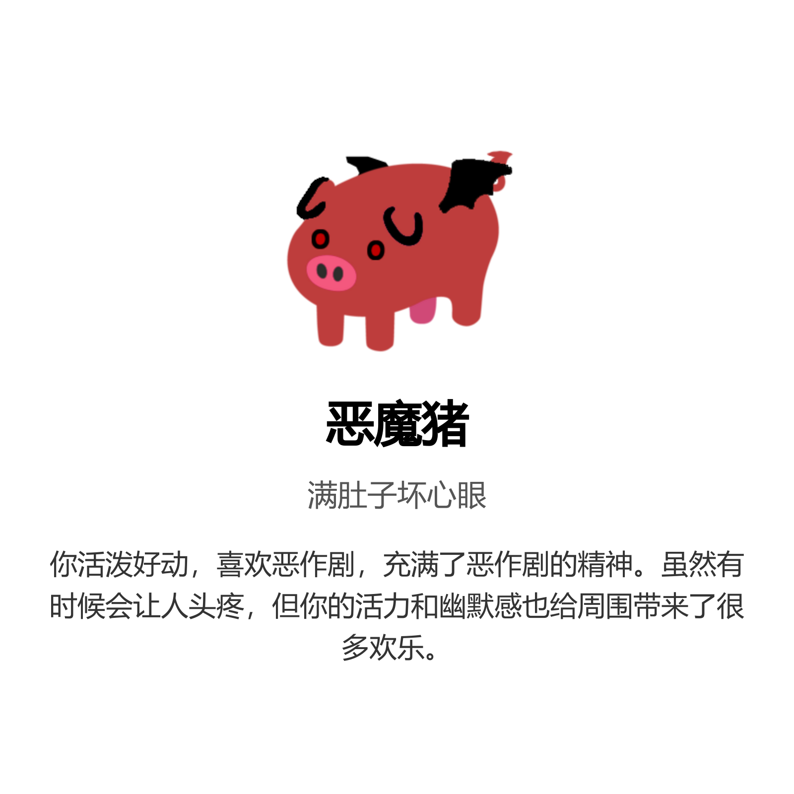

<div align="center">
  

  <h1>🐖 rollpig-plus 🐖</h1>

  <p><strong>“今天是什么小猪”的增强维护版</strong></p>
  <p>支持云端资源同步、图片版小猪图鉴、EX Lv. 成长、AI 烤猪与多 Bot 状态同步。</p>

  <p>
    = 3.10">
    
    
    
  </p>
</div>

> 本项目最初基于 [Bearlele/nonebot-plugin-rollpig](https://github.com/Bearlele/nonebot-plugin-rollpig) 修改，当前作为拓展分支继续开发。

## 🧭 和原项目怎么选

| 选择 | 更适合的情况 |
| --- | --- |
| 原作插件 | 想要更轻量、更接近最初玩法，只需要本地“今日小猪 / 随机小猪 / 找猪”等基础功能。 |
| rollpig-plus | 想要图片版小猪图鉴、EX Lv. 成长、多 Bot 状态同步、AI 烤猪、烤群友与日报等增强功能。 |

rollpig-plus 的目标是作为独立维护的增强分支继续演进：保留原作的核心趣味，拓展部分玩法，同时把资源、图鉴、云端同步和稳定性做得更工程化。原rollpig本体依然能与本项目一样获取到每月更新（也许）的最新小猪。

迁移时建议把原作插件替换为 rollpig-plus，不要在同一个 Bot 进程里同时加载两者；两者的基础指令和 `rollpig_*` 配置键高度重合，同时加载会造成命令响应和配置读取混杂。

## ✨ 效果预览

| 今日小猪 | 小猪图鉴 | 烤群友 |
| --- | --- | --- |
|  |  |  |

## 📦 安装

环境要求：Python `>=3.10`，NoneBot `>=2.4.0`。

发布到 NoneBot 插件商店后，可使用：

```bash
nb plugin install nonebot-plugin-rollpig-plus
```

当前也可以直接从 GitHub 主分支安装：

```bash
pip install -U "git+https://github.com/Felis2026/nonebot-plugin-rollpig-plus.git@main"
```

或固定到指定版本：

```bash
pip install -U "git+https://github.com/Felis2026/nonebot-plugin-rollpig-plus.git@v0.7.4"
```

加载插件时使用新的模块名：

```python
nonebot.load_plugin("nonebot_plugin_rollpig_plus")
```

如果首次使用图片渲染功能时 Chromium 环境缺失，可按 `nonebot-plugin-htmlrender` / Playwright 的提示安装浏览器运行时：

```bash
playwright install chromium
```

## 🐷 指令一览

| 指令 | 说明 |
| --- | --- |
| `今日小猪` / `今天是什么小猪` | 抽取今天属于你的小猪。每个用户每天只会生成一次结果，重复查看不会改变。 |
| `随机小猪 [数量]` | 从 PigHub 随机获取猪猪图，最多 10 张。 |
| `找猪 关键词` / `搜猪 关键词` | 从 PigHub 搜索猪猪图，例如 `找猪 玩偶`。 |
| `明日小猪` | 预测明天的小猪运势。 |
| `昨日小猪` | 查看昨天抽到的小猪。 |
| `今日烤猪` | 把今天的小猪做成美食；AI 烤猪需额外开启并配置 Key。 |
| `烤群友 @目标` | 在群聊中烤一位群友，带充能、概率与目标状态限制。 |
| `我的猪圈` | 查看已解锁数量、收藏率、最高 EX Lv.、本命猪等摘要。 |
| `小猪图鉴 [页码]` | 生成图片版小猪图鉴。 |
| `本周小猪` | 生成本周猪猪总结长图。 |

### 抽取与成长

- 每个用户每天只能抽取一次，跨天后重新抽取。
- 重复抽到已解锁小猪会提升专家等级（EX Lv.）。
- 连续重复时，后续抽到新猪的概率会逐步提高。
- 特殊形态（人类、熟食、吃掉了、售罄等）会参与烤猪与保护逻辑判定。

### 烤群友规则

- 常规概率：成功 60% / 逃脱 30% / 反噬 10%。
- 普通烤群友默认最多储存 2 次，每 8 小时恢复 1 次。
- 常规模式下，目标需先抽过今日小猪，且不能是人类、熟食形态、吃掉了或猪售罄。
- 加急点火口令可在限制范围内触发特殊成功判定；不会绕过目标资格检查。

## ⚙️ 配置方法

插件内置完整默认值：**完全不写 `.env`、不写 JSON 也能启动并使用基础功能**。

默认状态下：

- 本地存储启用，数据写入插件自己的 localstore 数据目录。
- AI 烤猪关闭；未配置 Key 时自动使用本地文案模板。
- 公有小猪资源同步开启；同步失败会回退旧缓存或内置资源。
- 私有资源 overlay 内置默认关闭；示例配置保留可用链接，方便需要时手动启用。
- 图片版小猪图鉴开启，默认 PNG 输出。
- 每日总结定时任务开启，可通过配置关闭。

配置优先级：

```text
.env / NoneBot 配置 > JSON 配置文件 > 插件默认值
```

推荐分工：

- JSON 配置文件：放非敏感、稳定参数。默认读取 Bot 运行目录下的 `rollpig_config.json`，也会读取 `config/rollpig.json`。
- `.env`：放 Token / Key / 私密覆盖项；如需自定义 JSON 路径，只在 `.env` 写 `ROLLPIG_CONFIG_FILE=/path/to/rollpig_config.json`。

下面用 `jsonc` 展示注释方便阅读；多数示例值按插件默认值填写，私有资源链接保留为“如何启用”的示意，不代表内置默认开启。实际 `rollpig_config.json` 必须是合法 JSON，可直接参考仓库内的 `rollpig_config.example.json`。

```jsonc
{
  "rollpig": {
    // ================================ AI 烤猪 ================================ //
    "rollpig_ai_enabled": false,               // 是否启用 AI 烤猪；只填 Key 不会自动开启
    "rollpig_model": "deepseek-chat",          // AI 模型名称，默认 DeepSeek Chat
    "rollpig_ai_timeout": 20.0,                // 单次 AI 文案生成超时时间（秒），超时自动回退本地模板
    "rollpig_ai_concurrency": 4,               // AI 文案生成并发上限，避免多人同时烤猪时堆积请求
    "rollpig_ai_max_tokens": 4096,             // AI 单次响应 token 上限，防止异常长输出
    "rollpig_ai_output_max_chars": 240,        // AI 文案入库前最大字符数，避免过长文本撑爆消息
    "rollpig_roast_cooldown_hours": 8,         // 普通烤群友每恢复 1 次所需小时数
    "rollpig_roast_charge_max": 2,             // 普通烤群友最多可储存次数；加急/强制点火不消耗

    // ================================ 存储与云端 ================================ //
    "rollpig_storage_backend": "local",        // local=本地 JSON；cloud=rollpig-cloud 多 Bot 同步
    "rollpig_cloud_api_url": null,             // cloud 模式的 rollpig-cloud 地址；默认不配置
    "rollpig_cloud_timeout": 3.0,              // 请求 rollpig-cloud 的超时时间（秒）
    "rollpig_cloud_strict_mode": true,         // true=云端异常直接失败；false=读接口可安全兜底

    // ================================ 小猪资源包 ================================ //
    "rollpig_resource_sync_enabled": true,     // 是否自动同步云端资源包；失败会回退旧缓存/内置资源
    "rollpig_resource_manifest_url": "https://pig.felislab.cc/resources/rollpig/manifest.json", // 公有全量包
    "rollpig_resource_sync_interval_hours": 24, // 自动检查资源更新的间隔小时数
    "rollpig_resource_sync_timeout": 10.0,     // 下载 manifest / pig.json / 图片的超时时间（秒）
    "rollpig_resource_max_file_size": 10485760, // 单文件下载大小上限，默认 10 MiB
    "rollpig_private_resource_manifest_url": "https://pig.felislab.cc/resources/rollpig-pjsk/manifest.json", // 可选私有 overlay 示例；内置默认关闭，不需要时设为 ""

    // ================================ 定时日报 ================================ //
    "rollpig_daily_summary_enabled": true,     // 是否启用每日总结定时任务；关闭后不推日报，也不刷新日报派生的次日保护

    // ================================ 图片版小猪图鉴 ================================ //
    "rollpig_catalog_enabled": true,           // 是否启用“小猪图鉴”图片命令；不替代“我的猪圈”
    "rollpig_catalog_render_concurrency": 2,   // 常驻 Playwright 页面池上限；小内存机器建议 1~2
    "rollpig_catalog_cache_seconds": 300,      // 同一状态指纹的图鉴结果缓存秒数，不会额外刷新 copies
    "rollpig_catalog_output_format": "png",   // 输出格式；默认 PNG
    "rollpig_catalog_render_timeout": 8.0,     // 单张图鉴渲染超时时间（秒）
    "rollpig_catalog_scale_factor": 2.0,       // 2x 渲染，提升文字和徽章清晰度
    "rollpig_html_render_concurrency": 2       // 所有 HTML/Chromium 生图的总并发预算
  }
}
```

建议留在 `.env` 的敏感项与路径覆盖：

```properties
# DeepSeek API Key；仅填写 Key 不会开启 AI，还需设置 ROLLPIG_AI_ENABLED=true
ROLLPIG_DEEPSEEK_KEY=sk-xxxxxxxxxxxxxxxx

# rollpig-cloud Bearer Token
ROLLPIG_CLOUD_TOKEN=replace-with-token

# 私有资源 Bearer Token；公开静态资源通常不需要
ROLLPIG_PRIVATE_RESOURCE_TOKEN=replace-with-token

# 可选：指定 JSON 配置文件位置
ROLLPIG_CONFIG_FILE=/path/to/rollpig_config.json
```

补充说明：

- 未开启 AI 或未配置 Key 时，会自动回退到本地文案模板。
- 未配置云端时，默认继续使用本地 `pig_data.json` 存储，不影响单 Bot 正常运行。
- 云同步可自行部署 [rollpig-cloud](https://github.com/Felis2026/rollpig-cloud)，也可以联系维护者申请接入现有 API。
- `ROLLPIG_STORAGE_BACKEND=cloud` 时，今日小猪、图鉴成长状态、普通烤群友充能、加急点火次数会在多 Bot 间同步。
- `ROLLPIG_CLOUD_STRICT_MODE=false` 只允许读接口使用安全兜底；关键写接口不会偷偷回退本地，避免多 Bot 数据脑裂。
- 私有资源 overlay 优先级高于公有云端资源和插件内置资源；公开版内置默认关闭，需要时填写 `rollpig_private_resource_manifest_url`，不需要时设为 `""`。
- `rollpig_daily_summary_enabled=false` 会跳过每日总结定时任务；该任务同时负责日报推送和日报派生的次日保护名单刷新。
- 超级用户可发送 `同步小猪资源` / `刷新小猪图鉴` 手动触发资源同步。
- 图片版图鉴每页固定展示 38 只小猪，不提供配置项，避免和当前底图安全区错位。

## 🐖 自定义小猪

本体内置资源位于：

```text
nonebot_plugin_rollpig_plus/resource/
```

最小资源格式：

```json
[
  {
    "id": "pig",
    "name": "猪",
    "description": "普通小猪",
    "analysis": "你性格温和，喜欢简单的生活，容易满足。"
  }
]
```

规则说明：

- `pig.json` 维护基础小猪信息。
- `resource/image/<id>.png` 为对应图片，文件名需要和 `id` 一致。
- `pig_rules.json` 维护熟食、特殊形态等规则，避免污染上游兼容的 `pig.json` 基础格式。
- 当前稳定支持 `png` 图片；如果未来支持 GIF，需要同步调整渲染和输出链路。
- 公有云端资源会缓存到 `data/localstore/nonebot_plugin_rollpig_plus/resources/active/`。
- 私有 overlay 会缓存到 `data/localstore/nonebot_plugin_rollpig_plus/resources/private_active/`。

## 📁 项目结构

```text
nonebot_plugin_rollpig_plus/
├─ __init__.py              # 指令注册与主流程
├─ catalog_renderer.py      # 图片版小猪图鉴渲染
├─ config.py                # 配置模型与 JSON 配置合并
├─ data_manager.py          # 本地 JSON 存储实现
├─ perf_logging.py          # 性能日志辅助
├─ render_budget.py         # HTML/Chromium 渲染并发预算
├─ resource_manager.py      # 云端小猪资源同步与本地缓存加载
├─ roast_manager.py         # AI 烤猪与文案生成
├─ runtime.py               # 宿主适配 / 群开关 / 运行时工具
├─ summary_service.py       # 每日总结聚合
├─ texts.py                 # 文案模板与特殊形态文本
├─ store/
│  ├─ base.py               # 存储接口定义
│  ├─ cloud.py              # rollpig-cloud 云端适配
│  ├─ factory.py            # local / cloud 后端选择
│  ├─ local_json.py         # 本地存储适配
│  └─ models.py             # 存储数据模型
└─ resource/
   ├─ pig.json
   ├─ pig_rules.json
   ├─ template.html
   ├─ catalog_base.png
   ├─ catalog_template.html
   ├─ catalog_anchor.html
   └─ image/
      └─ pig.png
```

## 🔗 相关项目

- 原作插件：[Bearlele/nonebot-plugin-rollpig](https://github.com/Bearlele/nonebot-plugin-rollpig)
- 小猪资源包：[Felis2026/rollpig-resources](https://github.com/Felis2026/rollpig-resources)
- 云端存储服务：[Felis2026/rollpig-cloud](https://github.com/Felis2026/rollpig-cloud)
- PigHub（搜猪功能支持）：[pighub.top](https://pighub.top/)

## 📋 最近更新

### v0.7.4

- 加强 PigHub 图库刷新缓存，避免并发触发时重复请求外部接口。
- 加固 AI 烤猪文案库落盘，降低事件循环阻塞与 JSON 损坏风险。
- 收束启动资源同步后台任务，并优化图鉴并发生成与本地数据读取边界。

### v0.7.3

- 整理为独立发布仓库与独立包名 `nonebot-plugin-rollpig-plus`。
- 模块名调整为 `nonebot_plugin_rollpig_plus`，补齐面向 GitHub / PyPI / NoneBot 商店的发布说明。
- 内置公共资源包，小猪默认数量更新至 149 只，并同步最新资源规则。

### v0.7.2

- 加固本地存储与云端资源同步，降低坏文件、坏 manifest、异常下载导致的数据风险。
- 优化 AI 烤猪并发与输出边界，默认并发调整为 4。
- 新增图片版小猪图鉴缓存与常驻页面池，改善重复触发时的渲染性能。

### v0.7.1

- 修复 PigHub 搜索接口变更导致的 `找猪` / `搜猪` 不可用问题。
- 新增 PigHub 新旧接口兼容与异常兜底。

完整更新日志见 [CHANGELOG.md](CHANGELOG.md)。

## 📄 许可证与致谢

插件代码使用 [MIT License](LICENSE)。

本项目最初基于 [Bearlele/nonebot-plugin-rollpig](https://github.com/Bearlele/nonebot-plugin-rollpig) 修改，感谢原作者提供的创意与基础实现。内置初始文案和部分猪图继承自原作；后续扩展资源由维护者创作、整理或来自公开用户投稿渠道。资源包的详细来源、使用边界与贡献说明请以 [rollpig-resources](https://github.com/Felis2026/rollpig-resources) 为准。
