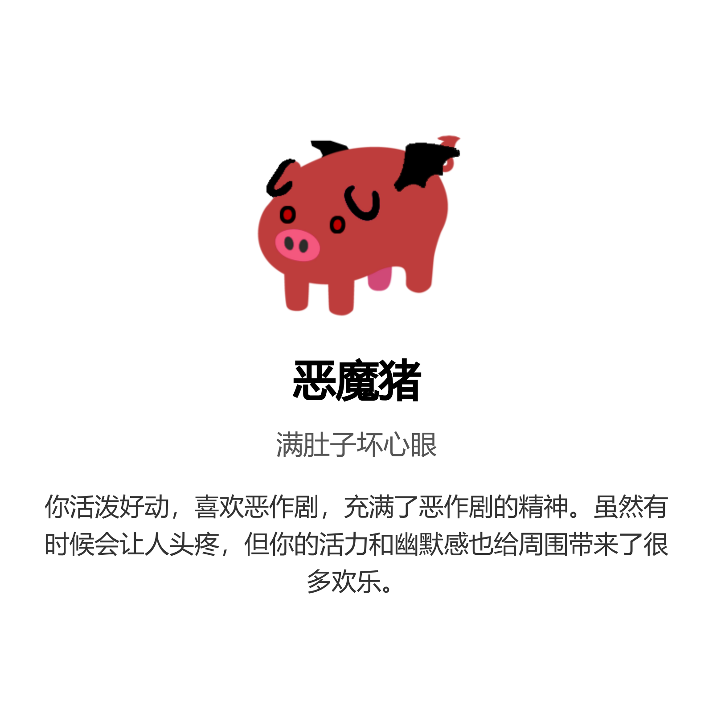
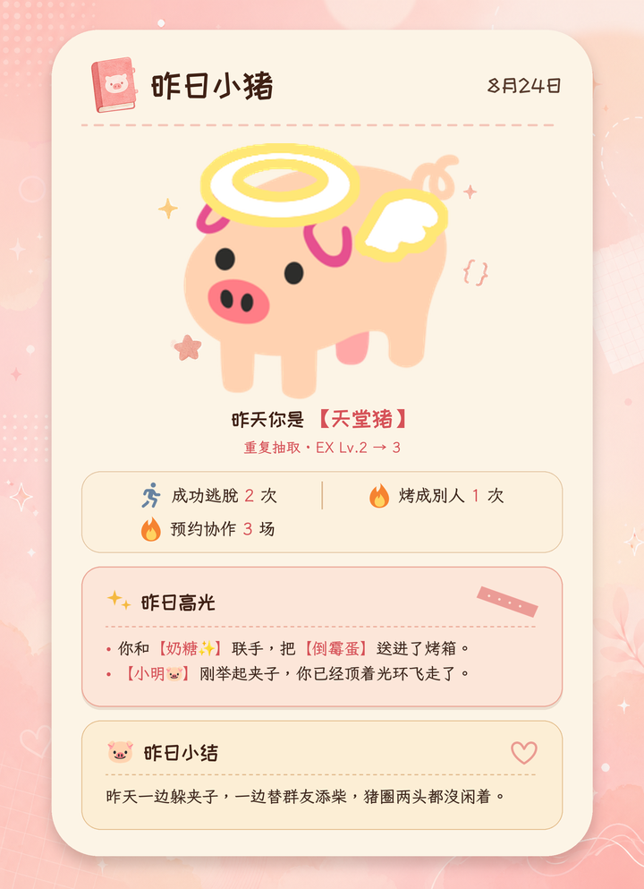

<div align="center">
  

  <h1>🐖 RollPig Plus 🐖</h1>

  <p><strong>围绕「今日小猪」的 NoneBot 群聊收集、成长与互动插件</strong></p>
  <p>每天抽一只属于你的小猪，慢慢养成属于自己的猪圈吧！也可以把群友烤了~</p>

  <p>
    = 3.10">
    = 2.4">
    
    <a href="LICENSE"></a>
  </p>

  <p>
    <a href="#-快速开始">快速开始</a> ·
    <a href="#-主要功能">主要功能</a> ·
    <a href="#️-常用指令">常用指令</a> ·
    <a href="#️-配置">配置</a> ·
    <a href="#-资源与扩展">资源与扩展</a>
  </p>
</div>

> RollPig Plus 最初基于 [Bearlele/nonebot-plugin-rollpig](https://github.com/Bearlele/nonebot-plugin-rollpig) 开发。  
> 在保留「每天抽一只小猪」核心玩法的基础上，继续扩展了图鉴成长、EX Lv.、烤群友、日报、云端资源与多 Bot 同步等能力。

## ✨ 效果预览

| 今日小猪 | 小猪图鉴 | 烤群友 |
| --- | --- | --- |
|  |  |  |

## 🐷 主要功能

| 模块 | 能做什么 |
| --- | --- |
| **今日小猪** | 每天抽取一只固定小猪；支持昨日回顾、明日预测、随机小猪和 PigHub 找猪。 |
| **猪圈成长** | 收藏小猪、查看图片图鉴；重复抽取会提升 EX Lv.，并逐步触发新猪保底。 |
| **EX 差分** | 资源包可为同一只猪提供不同 EX 等级的立绘和文案，不新增图鉴 ID，也不破坏已有成长数据。 |
| **烤猪互动** | 今日烤猪、烤群友、随机烤猪、加急生火、预约烤猪与烤箱补货。 |
| **群聊总结** | 可以为指定群开启每日小猪数据总结。 |
| **云端资源** | 公有小猪、GIF Overlay、EX 差分和共享烤猪文案可在线同步；失败时保留当前可用资源。 |
| **多实例同步** | 默认单机本地运行；可接入 RollPig Cloud，实现多群、跨 Bot 同步成长与互动状态。 |
| **可选 AI** | 不配置 AI 也能正常烤猪；开启后可使用 DeepSeek 生成更多文案，并与共享/本地文案共同使用。 |

RollPig Plus **不硬性要求接入 Cloud、 AI**。普通卡片与图鉴均使用 Pillow 渲染，默认配置即可运行基础功能。

---

## 🚀 快速开始

环境要求：

- Python `>= 3.10`
- NoneBot `>= 2.4.0`
- OneBot V11

### 使用 nb-cli

```bash
nb plugin install nonebot-plugin-rollpig-plus
```

### 使用 pip

```bash
pip install -U nonebot-plugin-rollpig-plus
```

如果你手动管理插件加载，请确认已加载：

```python
nonebot.load_plugin("nonebot_plugin_rollpig_plus")
```

启动 Bot 后直接发送：

```text
今日小猪
```

即可开始。

> [!IMPORTANT]
> 如果你从原版 RollPig 迁移到 Plus，请**替换原插件，不要在同一个 Bot 进程中同时加载两者**。  
> 两者的基础指令和 `rollpig_*` 配置项存在重合，同时加载会造成命令响应和配置读取混杂。

---

## 🎮 功能概览

### 每日抽猪与猪圈

每个用户每天只会生成一次正式抽取结果；当天重复查看不会改变。

抽到新猪会加入自己的猪圈；重复抽到已解锁小猪时，会继续累计次数并提升 **EX Lv.**。
达到对应等级后会自动使用新的差分图片或文案，如果发现仍没有变化，**那是还没做**，~~请狠狠催促赶工~~。


连续重复时还会逐步提高后续抽中新猪的机会，避免长期卡在重复收藏。

### 烤猪与烤群友

`今日烤猪` 会把自己的今日小猪做成料理。

`烤群友 @目标` 则是一套独立的群聊互动功能：发起者需要先抽取自己的今日小猪；目标已经抽猪时可以直接结算，目标还没抽猪时会自动建立**预约烤猪**。

第一位发起预约的人会成为主厨，其他群友可以继续**免费**烤目标群友实现添柴；等目标完成今日抽猪后，再统一结算这场预约。

### 群聊总结

`本周小猪` 会生成个人一周总结长图。

群主或管理员还可以通过 `小猪日报 开启` 为当前群开启每日总结；默认关闭，不会在安装后自动向群里推送。

<details>
<summary><strong>展开查看烤群友、预约与补货的详细规则</strong></summary>

#### 烤群友

- 常规结算概率：成功 `60%` / 逃脱 `30%` / 反噬 `10%`。
- 普通烤群友默认最多储存 `2` 次。
- 默认每 `8` 小时自然恢复 `1` 次。
- 发起者必须已经抽取自己的当日小猪。
- 特殊形态会参与烤猪保护和结果判断。

#### 预约烤猪

- 目标当天尚未抽猪时，`烤群友 @目标` 会自动建立预约。
- 第一位参与者成为主厨，并消耗一次普通烧烤充能。
- 后续最多 `11` 位群友可以免费加入，同一场最多 `12` 人。
- 目标完成今日抽猪后，由负责该预约的 Bot 继续完成结算与投递。
- Local 与 Cloud 后端均支持预约流程。

#### 烤箱补货

- 群主、管理员或 SUPERUSER 可以发起。
- 投票持续 `10` 分钟。
- 至少需要 `3` 名本群当日活跃用户。
- 达标后，为成功时本群全部今日活跃用户恢复普通烧烤次数至配额上限。
- 当天成功次数越多，门槛依次按活跃人数的 `25% / 35% / 45% / 55%` 计算。
- 对应票数上限为 `8 / 12 / 16 / 20`，至少需要 `2` 票。
- 第四次成功后门槛不再继续提高；失败不会增加下一次门槛。

</details>

---

## ⌨️ 常用指令

| 指令 | 说明 |
| --- | --- |
| `今日小猪` / `今天是什么小猪` | 抽取或查看今天的小猪。 |
| `昨日小猪` | 用回顾卡片查看昨天真实抽到的小猪、成长结果和与你有关的关键经历。 |
| `明日小猪` | 查看明日预测。 |
| `随机小猪 [数量]` | 从 PigHub 随机获取猪猪图，最多 10 张。 |
| `找猪 关键词` / `搜猪 关键词` | 按关键词搜索 PigHub 猪猪图。 |
| `我的猪圈` | 查看解锁数量、收藏率、最高 EX Lv.、本命猪等摘要。 |
| `小猪图鉴 [页码]` | 生成图片版收藏图鉴。 |
| `本周小猪` | 生成本周猪猪总结长图。 |
| `小猪投稿` / `投稿小猪` | 前往 RollPig 投稿平台提交小猪创意、完整小猪或 EX 等级差分。 |
| `今日烤猪` | 把自己的今日小猪做成料理。 |
| `烤群友 @目标` | 用魔法烤箱把群友做成美味的烤猪；目标未抽猪时自动进入预约流程。 |
| `随机烤猪` | 从当前群已有记录中随机选择目标烤。 |
| `加急生火 @目标` | 使用加急模式烤群友。 |
| `烤箱补货` | 管理员发起群体烧烤次数补货投票。 |
| `小猪日报 状态` | 查看当前群日报状态。 |
| `小猪日报 开启` / `小猪日报 关闭` | 群主或管理员控制当前群日报。 |
| `同步小猪资源` | SUPERUSER 手动触发资源同步。 |

---

## ⚙️ 配置

### 默认就能用

RollPig Plus 自带完整默认值，**不写 `.env`、不创建 JSON 配置文件也能启动**。

默认状态：

- 使用本地 JSON 存储；
- AI 烤猪关闭；
- 未配置 AI 时使用共享文案与本地模板；
- 公有小猪资源同步开启；
-  GIF 小猪 Overlay 随资源同步启用；
- 图片版小猪图鉴开启；
- 每日总结默认关闭；
- Cloud 关闭。

配置优先级：

```text
.env / NoneBot 配置 > JSON 配置文件 > 插件默认值
```

完整可用配置示例见：

[`rollpig_config.example.json`](rollpig_config.example.json)

默认会尝试读取 Bot 运行目录下的：

```text
rollpig_config.json
```

也兼容：

```text
config/rollpig.json
```

如果要指定其他位置：

```properties
ROLLPIG_CONFIG_FILE=/path/to/rollpig_config.json
```

### 开启 AI 烤猪

只填 Key **不会自动开启 AI**，还需要显式启用：

```properties
ROLLPIG_AI_ENABLED=true
ROLLPIG_DEEPSEEK_KEY=sk-xxxxxxxxxxxxxxxx
```

默认模型与其他 AI 参数可在 `rollpig_config.example.json` 中调整。AI 请求失败时会自动回退现有共享/本地文案，不影响基础功能。

### 接入 RollPig Cloud

默认 `local` 模式完全不需要 Cloud。

需要多 Bot 共用状态时，可以改为：

```json
{
  "rollpig": {
    "rollpig_storage_backend": "cloud",
    "rollpig_cloud_api_url": "https://your-rollpig-cloud.example.com"
  }
}
```

Token 建议放在 `.env`：

```properties
ROLLPIG_CLOUD_TOKEN=replace-with-token
```

Cloud 模式用于同步今日小猪、图鉴成长、烧烤充能等核心状态。关键写操作不会在异常时偷偷落回本地，避免多 Bot 产生数据分叉。

### 添加额外 Overlay

 GIF Overlay 无需手动配置。

例如要额外加载 PJSK 主题包：

```json
{
  "rollpig": {
    "rollpig_private_resource_manifests": [
      {
        "name": "pjsk",
        "manifest_url": "https://pig.felislab.cc/resources/rollpig-pjsk/manifest.json"
      }
    ]
  }
}
```

也可以填写自己的本地或私有资源包。

### 更换昨日回顾卡字体

昨日回顾卡的标题与正文可以分别替换字体。默认标题使用内置 ZCOOL 快乐体，正文使用插件已有的思源黑体；不配置也能直接使用。

例如，想把正文换成霞鹜文楷 TC Bold，可以从 [lxgw/LxgwWenKaiTC](https://github.com/lxgw/LxgwWenKaiTC) 下载字体文件，放进 Bot 运行目录下的 `fonts/`：

```text
fonts/LXGWWenKaiTC-Bold.ttf
```

再写入 `rollpig_config.json`：

```json
{
  "rollpig": {
    "rollpig_yesterday_card_title_font_path": null,
    "rollpig_yesterday_card_body_font_path": "fonts/LXGWWenKaiTC-Bold.ttf"
  }
}
```

两个配置都支持绝对路径；相对路径按 Bot 运行目录解析。留空、设为 `null`，或者字体文件无法读取时，会分别回退到内置标题字体和思源黑体，不影响昨日小猪使用。

<details>
<summary><strong>展开查看霞鹜文楷正文效果</strong></summary>

<p align="center">
  
</p>

</details>

<details>
<summary><strong>展开查看常用高级配置</strong></summary>

| 配置项 | 默认值 | 作用 |
| --- | --- | --- |
| `rollpig_ai_enabled` | `false` | 是否开启 AI 烤猪。 |
| `rollpig_model` | `deepseek-v4-flash` | AI 模型名称。 |
| `rollpig_roast_cooldown_hours` | `8` | 普通烧烤恢复 1 次所需小时数。 |
| `rollpig_roast_charge_max` | `2` | 普通烧烤最大储存次数。 |
| `rollpig_storage_backend` | `local` | `local` / `cloud` 存储后端。 |
| `rollpig_cloud_strict_mode` | `true` | Cloud 异常时保持关键写入严格一致。 |
| `rollpig_resource_sync_enabled` | `true` | 是否自动同步公共资源。 |
| `rollpig_resource_sync_interval_hours` | `24` | 自动检查资源更新间隔。 |
| `rollpig_roast_library_manifest_url` | RollPig Resources | 共享烤猪文案源；设为 `""` / `null` 可关闭。 |
| `rollpig_daily_summary_enabled` | `false` | 未单独设置的群是否默认启用日报。 |
| `rollpig_yesterday_card_title_font_path` | `null` | 昨日回顾卡标题字体；留空使用内置 ZCOOL 快乐体。 |
| `rollpig_yesterday_card_body_font_path` | `null` | 昨日回顾卡正文字体；留空使用内置思源黑体。 |
| `rollpig_catalog_enabled` | `true` | 是否启用图片版小猪图鉴。 |
| `rollpig_catalog_render_concurrency` | `2` | 图鉴并发绘制数；低内存部署可设为 `1`。 |

更多参数和默认值以 [`rollpig_config.example.json`](rollpig_config.example.json) 及当前版本源码为准。

</details>

---

## 📦 资源与扩展

RollPig Plus 的公共资源由独立仓库维护：

**[Felis2026/rollpig-resources](https://github.com/Felis2026/rollpig-resources)**

默认情况下，插件会自动读取和缓存：

- 公有基础小猪；
- 基础图片；
- EX 等级差分；
- RollPig Resources  GIF 小猪 Overlay；
- 共享烤猪文案。

资源同步采用 manifest、文件大小和 SHA-256 校验。新资源只有在完整校验通过后才会进入 active 状态；失败时继续使用当前可用缓存或插件内置资源。

自己想添加的资源可以通过 Overlay 追加或覆盖，不需要直接修改插件源码。

自建本地私有包可参考：

[rollpig-resources / 本地私有包指南](https://github.com/Felis2026/rollpig-resources/blob/main/docs/local-private-pack-guide.md)

> 资源文件的来源、版权和再分发条件以 `rollpig-resources` 仓库中的授权与来源说明为准；插件代码的 MIT License 不代表所有图片、文案和第三方素材都适用 MIT。

---

## ☁️ 多 Bot 同步

**RollPig Cloud 是可选组件，不是安装 Plus 的前置条件。**

单 Bot 或不需要跨实例共享数据时，保持默认 `local` 即可。

如果同一套 RollPig 运行在多个 Bot / 多个实例中，可以部署并接入以下项目：

**[Felis2026/rollpig-cloud](https://github.com/Felis2026/rollpig-cloud)**

**或者提 Issue 直接申请接入现有的 Cloud**

Cloud 主要负责把需要一致性的成长与互动状态放到统一后端，而图片、PigHub 索引和渲染等运行时资源仍由各实例本地处理。

---

## 🔄 和原版 RollPig 怎么选

| | 原版 RollPig | RollPig Plus |
| --- | --- | --- |
| 每日抽猪 | ✅ | ✅ |
| 随机 / 找猪 | ✅ | ✅ |
| 公有资源同步 | ✅ | ✅ |
| 图片收藏图鉴 | — | ✅ |
| EX Lv. 成长 | — | ✅ |
| EX 图片 / 文案差分 | — | ✅ |
| 今日烤猪 / 烤群友 | — | ✅ |
| 预约烤猪 / 补货 | — | ✅ |
| 周报 / 日报 | — | ✅ |
| 多 Overlay | — | ✅ |
| RollPig Cloud 多 Bot 状态 | — | ✅ |

如果你只需要最初的轻量功能，可以继续使用：

[Bearlele/nonebot-plugin-rollpig](https://github.com/Bearlele/nonebot-plugin-rollpig)

如果希望体验图鉴成长、群聊互动、EX、Cloud 和扩展资源，则更适合使用 Plus。

再次提醒：**不要在同一个 Bot 进程中同时加载原版和 Plus。**

---

## 🧱 项目与生态

| 项目 | 作用 |
| --- | --- |
| **[nonebot-plugin-rollpig-plus](https://github.com/Felis2026/nonebot-plugin-rollpig-plus)** | 围绕「今日小猪」的 NoneBot 群聊收集、成长与互动插件。 |
| **[rollpig-resources](https://github.com/Felis2026/rollpig-resources)** | 公共小猪、EX、GIF Overlay、共享文案与资源协议。 |
| **[rollpig-cloud](https://github.com/Felis2026/rollpig-cloud)** | 可选的多 Bot 状态同步后端。 |
| **[Bearlele/nonebot-plugin-rollpig](https://github.com/Bearlele/nonebot-plugin-rollpig)** | RollPig 原作与最初核心功能。 |
| **[PigHub](https://pighub.top/)** | `随机小猪` / `找猪` 使用的社区猪图来源之一。 |

---

## 🛠️ 开发与维护

仓库包含自动化测试，核心代码已经按业务职责拆分为：

- 指令与参数解析：`handlers/`
- 抽猪规则：`roll_flow.py`
- 烤群友：`roast_flow.py`
- 预约：`reservation_flow.py` / `reservation_delivery.py`
- 烤箱补货：`roast_refill.py`
- 资源同步：`resource_manager.py`
- PigHub：`pighub_service.py`
- AI / 共享烤猪文案：`roast_manager.py`
- 本地 / Cloud 存储：`store/`
- 卡片与图鉴渲染：`card_renderer.py` / `catalog_renderer.py`

完整版本变更请直接查看：

**[CHANGELOG.md](CHANGELOG.md)**

不再在 README 中重复维护每个版本的更新清单。

---

## 📄 许可证与致谢

插件代码使用 [MIT License](LICENSE)。

```text
Copyright (c) 2025 Bear_lele
Copyright (c) 2025-2026 Felis
```

本项目最初基于 [Bearlele/nonebot-plugin-rollpig](https://github.com/Bearlele/nonebot-plugin-rollpig) 开发，感谢原作者提供 RollPig 的核心创意与基础实现。

内置资源及云端资源并非全部由单一作者创作，也不统一适用插件代码的 MIT License。资源来源和授权条件请以：

- [rollpig-resources](https://github.com/Felis2026/rollpig-resources)
- [THIRD_PARTY_NOTICES.md](THIRD_PARTY_NOTICES.md)

中的实际说明为准。

普通卡片、图鉴和昨日回顾卡正文默认使用 Source Han Sans SC Medium，并通过 `pilmoji` 与 Google Noto Emoji 渲染彩色 Emoji；相关第三方许可见 `THIRD_PARTY_NOTICES.md`。
